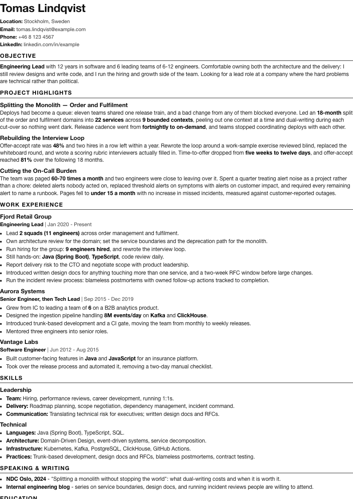
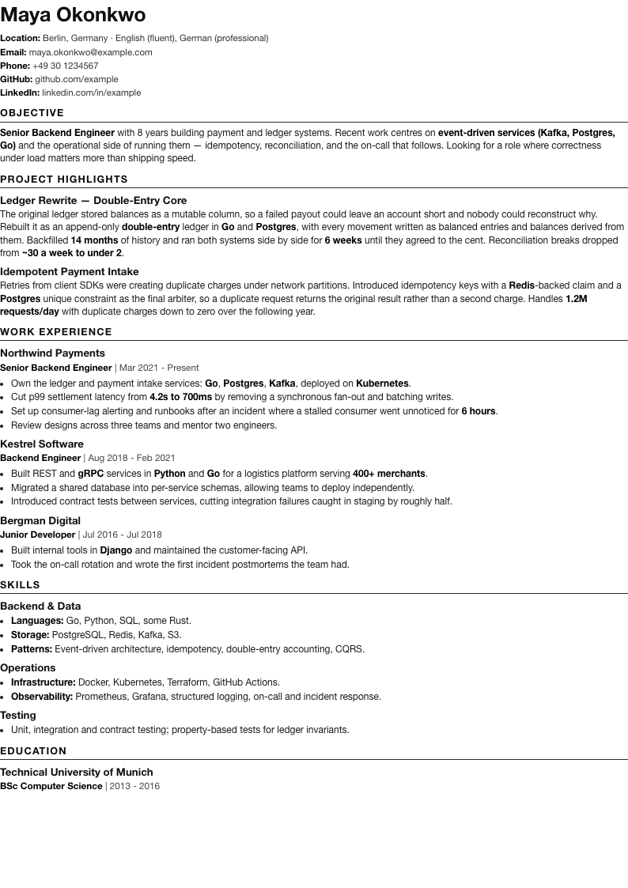
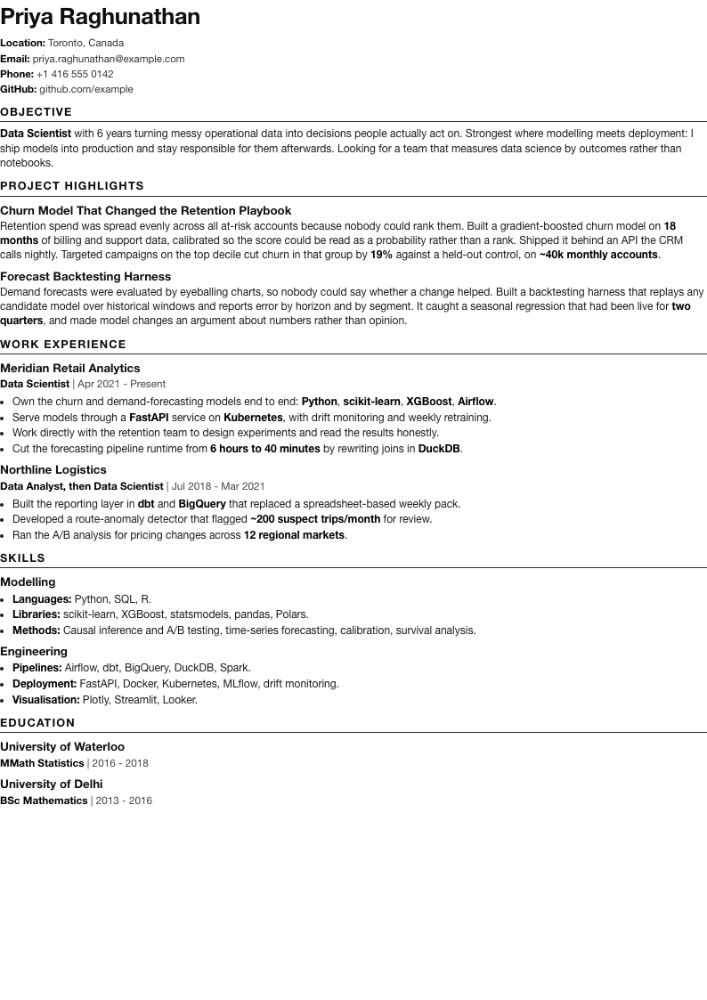
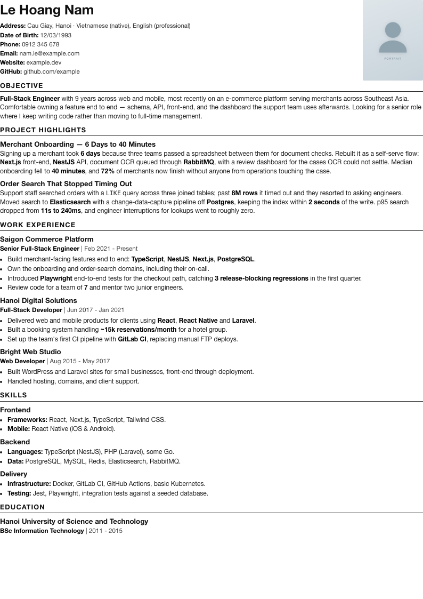

# fitcv

[](https://github.com/phuthuycoding/fitcv/actions/workflows/ci.yml)
[](https://www.npmjs.com/package/@tamanhquyen.it/fitcv)

<p align="center">
  
  <br>
  <sub><code>examples/engineering-lead.md</code> — plain Markdown in, two-page A4 PDF out</sub>
</p>

Build a CV from Markdown — a CLI **and** an MCP server for AI agents.

Two things set it apart from ordinary markdown→PDF tools:

- **`fit`** tells you *why* your CV does not fit on 2 pages. "Content too long" and "bad page break" are different illnesses with opposite cures — trimming words while the real culprit is a heading sitting 31px from the bottom of page 1 just wastes your time.
- **`lint`** checks *content*, not formatting. It catches overselling **and underselling** — claiming less than you did is a mistake too, and it costs you something while gaining nothing.

## Install

```bash
git clone https://github.com/phuthuycoding/fitcv.git
cd fitcv
npm install          # builds dist/ via the prepare script
npm link             # puts `fitcv` and `fitcv-mcp` on your PATH
```

Or from npm:

```bash
npm install -g @tamanhquyen.it/fitcv
```

The package is scoped, but the commands are not — you still type `fitcv` and `fitcv-mcp`.

Requires a Chromium-based browser already on your machine (Chrome, Chromium, Edge, Brave). fitcv deliberately does **not** download its own Chromium — it uses `puppeteer-core`, so the install stays small. If your browser lives somewhere unusual, point at it with `FITCV_CHROME=/path/to/chrome`.

## Usage

```bash
fitcv render cv.md -o Output.pdf     # build the PDF, report the page count
fitcv fit cv.md --pages 2            # why it does not fit yet
fitcv lint cv.md                     # audit the content
fitcv tailor cv.md --jd jd.txt       # compare against a job description
fitcv new techlead --from cv-master.md
fitcv list                           # every CV in the folder
fitcv diff cv-a.md cv-b.md           # what a tailored copy dropped
fitcv build --pages 2                # build every cv-*.md
```

### `fit` — page-break diagnosis

```
✗ 3 pages (target 2)
· content 1986px / 2080px available
· 31px wasted by page breaks

Blocks pushed to a new page:
  PROJECT HIGHLIGHTS (H2, y=1009) → wastes 31px at the end of page 1

Suggestions:
  Content HAS ROOM (94px to spare) — length is not the problem, the page break is.
  "PROJECT HIGHLIGHTS" at y=1009 has only 31px left before the end of page 1, so the whole block moved down.
  Fix: reorder sections, cut ~3 lines above it, or use --theme compact.
```

### `lint` — rules

| Rule | What it catches |
|---|---|
| `over-claim` | `spearheaded`, `rigorous`, `comprehensive`, `excellence`… — self-praise nobody can verify |
| `under-claim` | `advised on` / `worked on` next to real scale — you are probably selling yourself short |
| `tense` | a finished job still described in the present tense |
| `unsupported-skill` | a skill listed under SKILLS with no experience line backing it |
| `duplicate` | two bullets saying the same thing |
| `role-mismatch` | an IC job title paired with people-management language |
| `no-metric` | a long bullet with no number in it |
| `ats-emoji` | emoji in a heading — risky for ATS parsers |
| `long-bullet` | a bullet long enough that skimmers will skip it |

## Examples

Three complete CVs in [`examples/`](examples), written for different roles so you can see
how the same format stretches. Each one builds with the default theme and no photo.

<table>
<tr>
<td width="33%"><a href="docs/screenshots/backend-engineer.png"></a></td>
<td width="33%"><a href="docs/screenshots/engineering-lead.png"></a></td>
<td width="33%"><a href="docs/screenshots/data-scientist.png"></a></td>
</tr>
<tr>
<td align="center"><a href="examples/backend-engineer.md">backend-engineer.md</a><br><sub>1 page</sub></td>
<td align="center"><a href="examples/engineering-lead.md">engineering-lead.md</a><br><sub>2 pages</sub></td>
<td align="center"><a href="examples/data-scientist.md">data-scientist.md</a><br><sub>1 page</sub></td>
</tr>
</table>

### With a portrait photo

Markets differ: a CV in Berlin or Toronto normally carries no photo, while one in
Vietnam, Japan or Germany's more traditional employers usually does. Drop a
`photo.jpg` next to the markdown file and it lands in the top-right corner.

<p align="center">
  <a href="docs/screenshots/fullstack-engineer-photo.png">
    
  </a>
  <br>
  <sub><a href="examples/with-photo/fullstack-engineer.md">examples/with-photo/fullstack-engineer.md</a> — one page, photo auto-detected</sub>
</p>

The photo lives in its own folder because detection is per-directory: any `.md`
file next to a `photo.*` picks it up. Keep photo-less CVs in a separate folder,
or pass `--no-photo`.

Build them yourself:

```bash
fitcv build examples --pages 2
fitcv render examples/with-photo/fullstack-engineer.md --pages 1
```

Note what the bullets in those samples have in common: a number, or a before and after.
`lint` exists to push a CV in that direction — the samples are what it is aiming at, and
[`test/fixtures/bad-cv.md`](test/fixtures/bad-cv.md) is what it is aiming away from.

## MCP server

Lets an AI agent (Claude Code, Claude Desktop, Cursor…) build and audit CVs on its own.

Install it first (see [Install](#install) above), then point a client at `fitcv-mcp`.

Check the server starts (it waits for JSON-RPC on stdin and prints nothing — that is
correct; Ctrl+C to quit):

```bash
fitcv-mcp
```

### Register it with a client

After `npm link` the command is simply `fitcv-mcp`. Without it, use an **absolute path**
to `dist/mcp/server.js`. The repo ships `.mcp.json.example` to copy from.

**Claude Code** — add to `.mcp.json` in your project (shared with the team), or `~/.claude.json` (just you):

```json
{
  "mcpServers": {
    "fitcv": {
      "command": "fitcv-mcp",
      "cwd": "/path/to/your/cv/folder"
    }
  }
}
```

Or add it from the command line:

```bash
claude mcp add fitcv -- fitcv-mcp
claude mcp list          # confirm it connected
```

Restart the client afterwards so it picks the server up.

**Claude Desktop** — `~/Library/Application Support/Claude/claude_desktop_config.json` (macOS) or `%APPDATA%\Claude\claude_desktop_config.json` (Windows), same `mcpServers` shape, then restart the app.

**Cursor** — `.cursor/mcp.json` in the project, same shape.

### File paths in tool arguments

Every tool takes a file path. Relative paths resolve against the **server process's working directory**, so either pass absolute paths or give the server a `cwd`:

```json
{
  "mcpServers": {
    "fitcv": {
      "command": "node",
      "args": ["/path/to/fitcv/dist/mcp/server.js"],
      "cwd": "/path/to/your/cv/folder"
    }
  }
}
```

### Tools

| Tool | Purpose |
|---|---|
| `render_cv` | build the PDF, return the real page count plus layout numbers |
| `check_fit` | why it does not fit in N pages: too long, or bad page breaks |
| `lint_cv` | audit content (overselling, underselling, tense, unbacked claims…) |
| `tailor_to_jd` | compare against a job description (`jd_file` or `jd_text`) |
| `list_variants` | list every CV in a folder |
| `new_variant` | start a tailored copy from a master file |
| `diff_variants` | compare two versions, see what a tailored copy dropped |

Every tool returns **structured JSON**, not prose — so an agent can loop on it: edit the markdown → `check_fit` → read `slackPx` and `culprits` → edit again, until it fits.

### Requirements

Node >= 18 and a Chromium-based browser. If it is in a non-standard location:

```json
{ "mcpServers": { "fitcv": { "command": "node", "args": ["..."],
  "env": { "FITCV_CHROME": "/path/to/chrome" } } } }
```

## CV format

Plain Markdown. The only convention lives in the header:

```markdown
# Your Name

**Email:** you@example.com
**Phone:** +84 9xx xxx xxx

***

## OBJECTIVE
...

## WORK EXPERIENCE

### Company Name

**Job Title** | Jan 2020 - Dec 2023

* Bullet...
```

`**Label:** value` lines directly under `# Your Name` become the contact block. A line containing `|` is read as job title + dates — and `lint` uses those dates to know whether a job has ended.

**Portrait photo:** drop `photo.jpg` (or `photo.png`, `avatar.jpg`) next to the `.md` file and it is embedded in the top-right corner. Without one you get an empty placeholder box. Photos over 400KB trigger a warning, because they push the PDF past the upload limit many job portals enforce.

**Skip a file in `fitcv build`:** put `<!-- fitcv:no-build -->` near the top. Useful for a master file that is a content store rather than something you submit.

## Themes

`classic` (default) and `compact`. Both are single-column, emoji-free, with a real text layer — safe for ATS parsers.

## License

MIT
